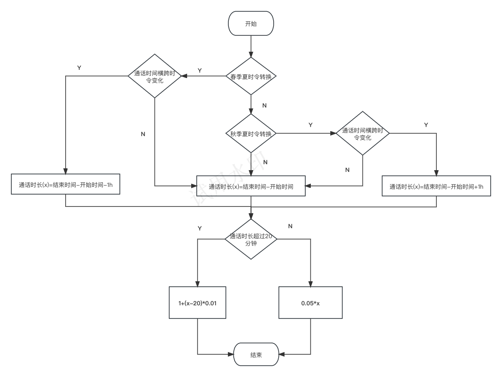

1. 将6.4三角形问题的等价类测试用例用Xmind思维导图模式组织，需子集划分清晰，层次分明。


2. 课本P76 6.9习题第5题

- 通话账单计算流程



```
分析：
夏时令是3月份第二个星期日到11月份第一个星期日。
以2023年为例，夏时令的春季转化在2023年3月11日，在1:59:59的下一秒是3:00:00。
夏时令的秋季转换在2023年11月4日，在2:59:59的下一秒是2:00:00。

```

- 等价类测试案例

| 开始时间| 结束时间|时长|预期费用|跨时令|通话超过20min|
| ----------------- | ----------------- | --------  | ----------- | ---- | ---- |
| 2023.3.11 1:00:00 | 2023.3.11 1:10:00 |   10min   |     $0.5    | 否 | 否 | 
| 2023.3.11 1:00:00 | 2023.3.11 1:40:00 |   30min   |     $2.0    | 否 | 是 | 
| 2023.3.11 1:50:00 | 2023.3.11 3:10:00 |   20min   |     $1.0    | 是 | 否 | 
| 2023.3.11 1:50:00 | 2023.3.11 3:20:00 |   30min   |     $2.0    | 是 | 是 | 
| 2023.11.4 1:59:59 | 2023.11.4 2:09:59 |   10min   |     $0.5    | 否 | 否 | 
| 2023.11.4 1:59:59 | 2023.11.4 2:29:59 |   30min   |     $2.0    | 否 | 是 |
| 2023.11.4 2:49:59 | 2023.11.4 2:09:59 |   20min   |     $1.0    | 是 | 否 |
| 2023.11.4 2:59:59 | 2023.3.11 2:39:59 |   30min   |     $2.0    | 是 | 是 | 
| 2023.11.4 1:59:59 | 2023.11.4 2:09:59 |   70min   |     $6.0    | 是 | 是 | 
| 2023.10.1 1:00:00 | 2023.10.1 1:10:00 |   10min   |     $0.5    | 否 | 否 |
| 2023.10.1 1:10:00 | 2023.10.1 1:40:00 |   30min   |     $2.0    | 否 | 是 | 
| 2023.10.1 1:50:00 | 2023.10.1 3:10:00 |   80min   |     $7.0    | 否 | 是 |
